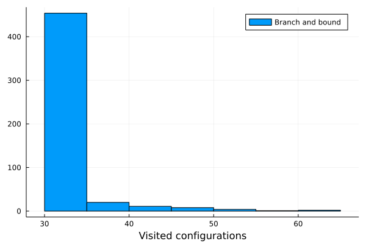

# Knapsack problem
### Decision version, solved using brute force and branch and bound
#### NI-KOP 2021

Description of the problem:

Given set of items {x1, ... xn} with respective
prices {c1, ... cn} and weights 
{w1, ... wn}, can you find subset of these
items so that the sum of prices is at least **B** and the sum of their
weights does not exceed **M**?

This problem is known to be NP-complete, which means 
there is no known algorithm both correct 
and fast (polynomial-time) in all cases.

## Brute force
To find solution for this problem I first implemented
naive solution using *brute force*. I created superset of all items
and checked the price and weight of each subset. Due to high
computational demans I was able to solve this problem
only up to 15 items.

## Results for *brute force*
### NR dataset

| N of items | Average | Median | Std. | Min | Max |
|------------|:-------:|:------:|:----:|:---:|:---:|
| 4          |  9      |  7     | 6.48 | 1   | 16  |
| 10         |    570  |   854  |474.82|1    |1024 |
| 15         |    18287|  30847 |  15401.71|1    |32768|
| --         |         |        |      |     |     |
| --         |         |        |      |     |     |
| --         |         |        |      |     |     |

Reader can see that the number of visited configurations grows *exponentially* with **N** of available items.
What is interesting is also the minimal and maximal number of visited configurations.
NR dataset contains 6 subsets for *N* available items (4, 10, 15, 20, 30, 40). Each subset
is composed of 500 instances of Knapsack problem - different **B**, **M** and different items.
Because brute force tries every possible combination it is no surprise that
maximum number of visited configurations is equal to 2*N*. In each of these
instances is at least one where algorithm can choose only one item to
meet **B** and **M** requirements and this is the reason for 1 as the minimal number of
visited configurations.

On the other end is ZR dataset which contains *tricky* instances, that have **no** 
trivial solution (only one item). The maximum number
of visited configurations remains same
and average and median values are very high.

In both dataset the worst case scenarios for computational complexity have been met,
showing (not proving!) the O(2N) complexity.
This algorithm does no preprocessing (removing too heavy items, ordering items based on ratio..)
and the average value heavily depends on the number of items. In case of ZR dataset, average 
value is close to upper range.

### ZR dataset

| N of items | Average | Median | Std. | Min | Max |
|------------|:-------:|:------:|:----:|:---:|:---:|
| 4          |    13   | 13     | 2.88 |  5  | 16  |
| 10         |    926   |   972   |116.42|500  |1024|
| 15         |    31041   |  32204    |  2404.89|20739   |32768 |
| ---        |       |      |  |   |   |
| ---        |       |      |  |   |   |
| ---        |       |      |  |   |   |

## Branch and bound

1. Sort all items in decreasing order of V/W so that upper bound
    can be computed using Greedy Approach.

2. Initialize profit, max = 0 
3. Create an empty queue, Q. 
4. Create a dummy node of decision tree and enqueue it to Q. Profit and weight of dummy node are 0. 
5. Do while (Q is not empty).
- Extract an item from Q. Let the item be x. 
- Compute profit of next level node. If the profit is more than max, then update max. (Profit from root to this node (include this node)).
- Compute bound of next level node. If bound is more than max, then add next level node to Q.(Upper Bound of the maximum Profit in subtree of this node)
- Consider the case when next level node is not considered as part of solution and add a node to queue with level as next, but weight and profit without considering next level nodes.

Description taken from [medium.com](https://medium.com/@leenancyparmar1999/knapsack-problem-branch-and-bound-approach-1fdab6d9a241).

The bounding process, as I implemented it, takes into account the upper bound of the node (subtree of this node).
If the upper bound (optimistic prediction) in node *A* is lower than max value of different node *B*, there is no need
to expand this node as in each case the algorithm already found better solution. 
## Results for *branch and bound*
### NR dataset

| N of items | Average | Median | Std. | Min | Max |
|------------|:-------:|:------:|:----:|:---:|:---:|
| 4          |    8    | 8      | 0.56 |  8  | 12  |
| 10         |    21   |   20   |  3.39|20   |64   |
| 15         |    31   |  30    |  4.13|30   |  62 |
| 20         |    42   |  40    |  6.12|40   | 92  |
| 30         |    64   |60      | 13.32| 60  | 242 |
| 40         |   84    |   80   |12.64 |  80 |   198|

NR dataset is the simpler dataset where it is possible to find instances which 
can be solved by taking only one item. The algorithm of *branch and bound* however
creates a tree and chooses the items based on their *price to weight* ratio. 
If the tree starts with an item that is too heavy, new level of tree will be created.
The striking difference between *brute force* and *branch and bound* is immediately seen
in average and median values of visited configurations which progress *lineary* compared
to *exponential* trend of *brute force*. Also the standard deviaton (**std.**) 
is much lower than in *brute force*.
We can see that because of bounding, the minimum number of visited configurations does 
not equal to 2x, neither maximum number. Bounding means that leaves of the tree
with invalid configuration (too heavy or too cheap) are not expanded anymore.
### ZR dataset

| N of items | Average | Median | Std. | Min | Max |
|------------|:-------:|:------:|:----:|:---:|:---:|
| 4          |    8    | 8      | 0.28 |  8  | 10  |
| 10         |    20   |   20   |  0.0|20   |20   |
| 15         |    30   |  30    |  0.0|30   |  30 |
| 20        |   40    |   40   | 0.0 | 40  |  40 |
| 30        |   60    |   60   | 0.0 | 60  | 60  |
| 40        |   80    |  80    | 0.0 | 80  | 80  |

I suspect this dataset to be tailored to show the advantage of *branch and bound* algorithm.
I support my argument by observind the values of **std.**, that have somewhat synthetic values.
Apart from instances with 4 items, in every instance with same number of items the algorithm
visited same number of configurations. That 
The difference in results between *brute force* and *branch and bound* instances 
in **ZR** with **4, 10, 15** are evident.

The worst case scenarios are somewhat independent on the number of items because in preprocessing
these items are ordered based on their value/weight ratio. The growth is definitely not exponential (see N=30 and N=40).
The average number of visited configurations shows linear growth.

## Comparison in visited configurations

These two histograms were created on solving the subset of **NR** with *15* availeble items.

Below is the frequency, depicted by histogram, of visited configurations. 
Because of large range of values **[1, 32768]**, the histogram was created with
7 bins, each containing summed frequency of less than 5000 visited configurations.
The *brute force* algorithm had some success in finding the solution in first 5000 tries,
but as can be seen in the last bin, the majority of the solutions required almost the maximum
number of visited configurations. This arguments is also supported by the *median* which
is 30847.

Histogram below was created with solutions made by *branch and bound* algorithm. Notice the
strinkingly lower range of values - **[30, 65]** compared to **[1, 32768]** of *brute force*.
Because this complex algorithm *bounds* invalid leaves and chooses the items 
based on their price/weight ratio and prefers efficient items,
the solutions is found in the at the beginning of the run - most of the solutions
required less than **36** visited configurations, which is supported by the average value
**31** and median **30**.

